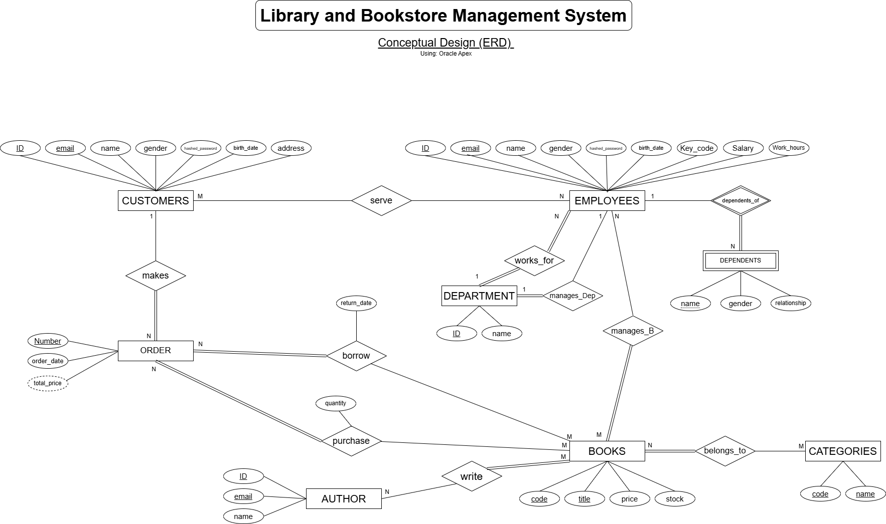

# Library and Bookstore Management System (LBMS)

Course project for **Database Concepts and Design (DBCD)** — King Faisal University, College of Computer Sciences & Information Technology.
Academic year 2025-26, Semester II. Instructor: **Muhammad Aasim Rafique**.

The project designs and implements a relational database that centralizes a library's employees, customers, departments, orders and book inventory, so that borrowing, purchasing, staffing and reporting all run off one consistent data model.

## Repository contents

```
assets/
  LBMS_ERD3.png            Entity-Relationship Diagram (conceptual design)
  Logical Diagram2.png     Relational schema (logical design)
docs/
  SRS - LBMS (DBCD).docx / .pdf            Full SRS report (with student IDs)
  SRS - LBMS (DBCD) (N0 ID).docx / .pdf    Same report, student IDs removed
  Project template with description.docx   Course-provided report template
  Announcement Project.pptx                Course project announcement
```

The SRS is the main deliverable: it carries the case description, requirement specification, ERD, logical design, the full `CREATE TABLE` script, the report queries, and the task/assignment table.

## Team

| Student | Main contributions |
| --- | --- |
| Reda Alqatifi | Problem statement, SRS, conceptual design (ERD), 1 table, schema fixes and ordering |
| Ali Alburahim | Logical model, data population, SQL retrieval queries, 1 table |
| Abdullah Alkhathlan | Physical design (6 tables), forms |
| Ali Alkhars | Physical design (6 tables), reports |

## System analysis

**Users:** Employee (including the Manager role) and Customer.

**Main functions**

1. Store and maintain employee profiles (personal, contact and work information such as salary and work hours).
2. Organize employees into departments and track the departmental structure.
3. Let the manager add, delete and update books, with oversight of purchased and borrowed copies.
4. Generate reports on departments, orders, customer data and employee load.
5. Enforce role-based access so sensitive information reaches only authorized personnel.
6. Manage customer orders — borrowing and purchasing — including return dates and order history.
7. Maintain employees' dependents for family support or insurance claims.

**Main reports**

1. Books with low or zero stock.
2. Most borrowed/purchased books by category.
3. Number of authors who published books in the library.
4. Number of customers and employees, with their details.
5. Order details — for whom and when.
6. Department details, including its employees and manager.

## Database design

### ERD



### Logical model


### Tables

| Table | Purpose |
| --- | --- |
| `Customer` | Customer accounts: identity, credentials, address |
| `Department` | Departments, each managed by one employee |
| `Employees` | Staff records: salary, work hours, key code, department |
| `Dependents` | Employee dependents; composite PK `(Employee_ID, Dep_Name)` |
| `Books` | Book catalogue: code, title, price, stock |
| `Authors` | Authors with unique contact email |
| `Categories` | Book categories |
| `Orders` | Customer orders with date and total price |
| `Purchase` | Purchased books per order, with quantity |
| `Borrow` | Borrowed books per order, with return date |
| `Book_Authors` | Many-to-many: books ↔ authors |
| `Book_Categories` | Many-to-many: books ↔ categories |
| `Manage_Books` | Which employee (manager) manages which book |
| `Employee_Customer_Serve` | Which employees served which customers |

Notes on the physical design:

- Tables are created in dependency order so foreign keys resolve cleanly.
- `Department.Manager_ID` is added as a foreign key **after** `Employees` exists, via a separate `ALTER TABLE ... ADD CONSTRAINT FK_Manager`, because the two tables reference each other.
- `Dependents` uses a composite primary key, since a dependent name is only unique within one employee.
- Every relationship table uses a composite primary key over its two foreign keys.

## Getting started

The SQL is documented inside the SRS rather than kept as a standalone script. To build the database:

1. Open `docs/SRS - LBMS (DBCD).pdf` and go to section **5. Physical Design**.
2. Run the `CREATE TABLE` statements in order, including the `ALTER TABLE Department` step after `Employees`.
3. Populate the tables with enough records to exercise the reports (section **6. Populate Database**).
4. Run the queries from section **7. Queries** to verify the data loaded as intended.

Example — books at or below a stock threshold of 5:

```sql
SELECT Book_Code, Title, Price, Stock
FROM Books
WHERE Stock <= 5
ORDER BY Stock ASC;
```

## Status

Problem statement, SRS, ERD, logical model, physical design and the report queries are complete. Data population, application forms and the report interfaces are the remaining deliverables.
